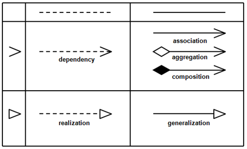

# System Modeling

Building an OO system identifying abstractions of real world things and relationships between those abstractions.

We want a way to quickly model and represent these relationships, which can be a blueprint or just a quickly readable representation of our program.

## Unified Modelling Language (UML)

|name of the class| Vec |
|---|---|
|fields (optional)|-x: integer|
||-y: integer|
||// the "-" means that it's private|
|methods (optional)|+ operator+ : Vec|
||+ getX : integer|

Visibility:
- `-` stands for private
- `+` stands for public

## "Owns-a" relationship - compositional

```c++
class Vec {
  int x, y;
public:
  Vec(int x, int y) : x{x}, y{y} {}
};

class Basis {
  Vec v1, v2;
  // add this to get rid of error
  Basis() : v1{1,2}, v2{3,7} {}
};

Basis b; // error!
```

We try to default construct `b` with Basis's built in default ctor which just default constructs all fields that are objects, namely `v1` and `v2`, but `Vec` doesn't have a default ctor.

Embedding an object inside another object. This kind of a relationship is called a composition. A composition relationship is also another broader type of a relationship called an "owns-a" relationship.

If `A` owns `B`, then:

- If `A` dies so does `B`
- `B` has no identity outside of `A`, if you're talking about `B`, it's in the context of `A`
- If you copy `A`, then you're also copying `B` (deep copy)

Example: A car owns 4 wheels, they are a part of that car. If the car is destroyed, the wheels are too. If you copy a car, you copy it's wheels as well.

Implementation of an "owns-a" relationship is usually done through compilation of classes.

Modeling:



## "has-a" relationship - aggregation

Compare the car to music player's playlists. The car owned it's components, what about a playlist? Deleting a playlist doesn't delete those songs. This is a "has-a" relationship. (aggregation)

If `A` has `B`, then typically:
- If `A` dies, `B` still exists
- `B` has existance apart from its associated `A`
- If `A` is copied, `B` is not (shallow copy) thus copies of `A` share the some `B`

Typical implementation - You have pointers to the things you "have"
