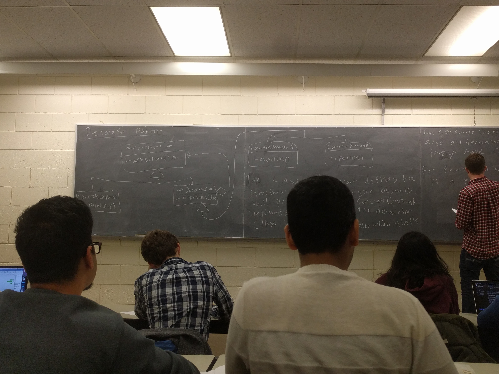
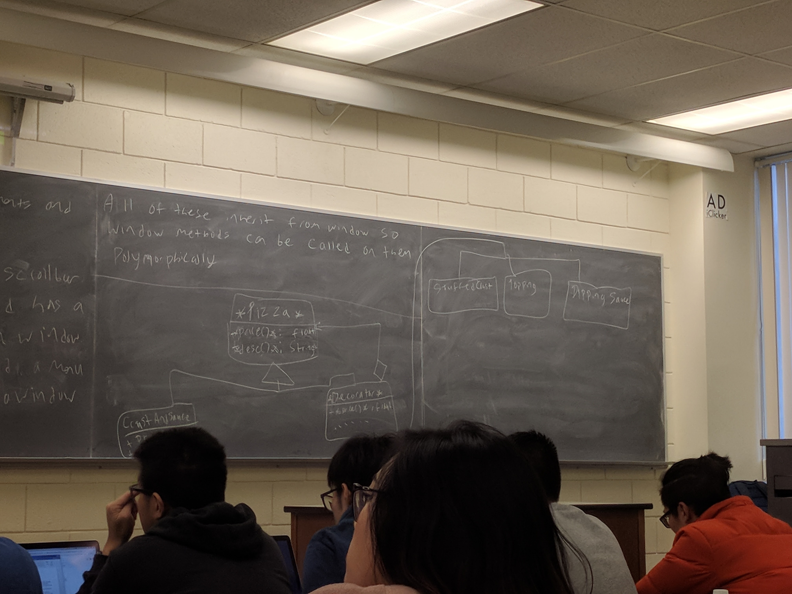

# Decorator Pattern

Suppose we want to enhance an object (add features/functionality to it on runtime), example a windowing system.

We start with a basic window. We want to add a scroll bar and a menu for selecting options. We would like to choose these enhancements at runtime.



The class component defines the interface: the operations your objects will provide. The class `ConcreteComponent` implements the interface the decorator classes inherit from `Decorator` which inherits from the `Component` itself.

For example, a `Window` with a `Scrollbar` is a kind of `Window`, abd has a pointer to the underlying plain `window`. A `window` with a `Scrollbar` and a `Menu` is a `Window`, and has a ptr to a `Window` with a `Scrollbar`.

All of these inherit from a `Window`. So window methods can be called on them polymorphically.



```c++
class Pizza {
public:
  virtual float price() const = 0;
  virtual string desc() const = 0;
  virtual ~Pizza();
};

class CrustAndSauce : public Pizza {
public:
  float price() const override {
    return 5.99;
  }

  string desc() const override {
    return "pizza";
  }
};

class Decorator : public Pizza {
protected:
  Pizza *p;

public:
  Decorator(Pizza *p)
  : p{p} {

  }

  // you can't remove toppings from your pizza!
  virtual ~Decorator() {
    delete p;
  }
};

class StuffedCrust : public Decorator {
public:
  StuffedCrust(Pizza *p) : Decorator{p} {

  }

  float price() const override {
    return p->price() + 2.69;
  }

  string desc() const override {
    return p->desc() + " with stuffed crust.";
  }
};

class Topping : public Decorator {
string theTopping;

public:
  Topping(pizza *p, string theTopping)
  : Decorator{p}, theTopping{theTopping} {

  }

  float price() const override {
    return p->price() + 1.00;
  }

  string desc() const override {
    return p->desc() + " with " + theTopping;
  }
};

// Client side code

Pizza *p1 = new CrustAndSauce;
p1 = new Topping{p1, "cheese"};
p1 = new StuffedCrust{p1};

cout << p1->desc() << " " << p->price() << endl;
delete p1;
```
