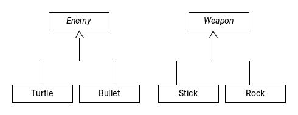

# Visitor Pattern

For implementing double dispatch, virtual methods are chosen on the actual run time type of objects. What if we have a function that operates on two objects?

Example: We want to be able to hit an enemy with a weapon.



We want something along the lines of `virtual void strike(Weapon &w, Enemy &e)`

If we put the enemy, we only get dispatched on enemies' virtual method

<mark>If we put it in weapon, the trick is to double dispatch it to combine overloading and overriding</mark>

```c++
class Enemy {
public:
  virtual void beStruckBy(Weapon &w) = 0;
  ...
};

class Turtle : public Enemy {
public:
  void beStruckBy(Weapon &w) override {
    w.strike(*this);
  }
};

class Bullet : public Enemy {
public:
  void beStruckBy(Weapon &w) override {
    w.strike(*this);
  }
};

class Weapon {
public:
  virtual void strike(Turtle &t) = 0;
  virtual void strike(Bullet &b) = 0;
};

class Stick : public Weapon {
public:
  void strike(Turtle &t) override {
    // hit a Turtle
  }
  void strike(Bullet &b) override {
    // hit a Bullet
  }
};

class Rock : public Weapon {
public:
  void strike(Turtle &t) override {
    // hit a Turtle
  }
  void strike(Bullet &b) override {
    // hit a Bullet
  }
};

// Client side code

Enemy *e = new Turtle;
Weapon *w = new Rock;
e->beStruckBy(*w);
```

1. Virtual dispatch calls `Turtle.beStruckBy()`
2. `Turtle.beStruckBy` calls Weapon's virtual method strike that takes a turtle param (compile time)
3. Virtual dispatch chooses `Rock::strike` with a turtle param
4. Done

Visitors can be used as a way to provide an arbitrary hook into your class for specialized behaviour

Example: Add a visitor to the `Book` hierarchy that allows for adding functionality without recompiling the classes themselves.

```c++
class Book { // enemy
public:
  virtual void accept(BookVisitor &v) {
    v.visit(*this);
  }
};

class Text : public Book {
public:
  void accept(BookVisitor &v) {
    v.visit(*this);
  }
};

class BookVisitor { // weapon
public:
  virtual void visit(Text &t) = 0; // strike
  virtual void visit(Book &t) = 0;
  virtual void visit(Comic &t) = 0;
};
```

Track how many `Books` of each type we have. Group `Books` by author for `Book`, `hero` comic, and topic for text.

We use a `map<string, int>`. We could add a virtual method virtual method `virtual void updateMap(map<string, int> &m)` to our book hierarchy. Or we could write a visitor.

```c++
class Catalogue : public BookVisitor {
  map<string, int> theCatalogue;

public:
  void visit(Book &b) override {
    ++theCatalogue[b.getAuthor()];
  }

  void visit(Text &t) override {
    ++theCatalogue[t.getTopic()];
  }

  void visit(Comic &c) override {
    ++theCatalogue[c.getTopic()];
  }
};
```

Book includes `BookVisitor.h` which implements `text.h` which itself includes `book.h` - **A circular dependency!**

But are all these includes really necessary?
