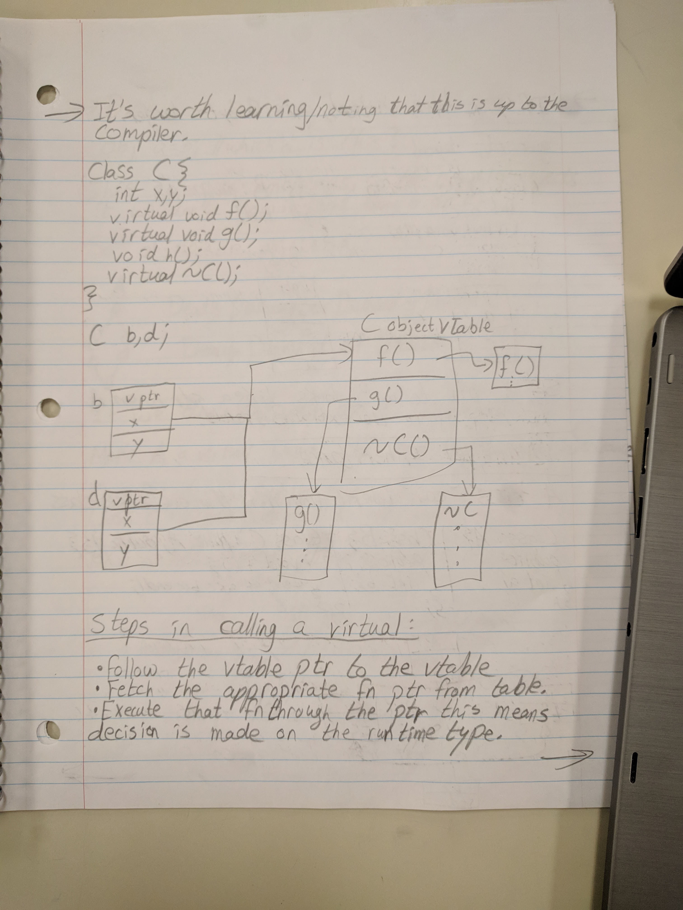

# How do virtual functions work?

Consider teo classes

```c++
class Vec {
    int x, y;
public:
    int doSomething() {
        ...
    }
};

class Vec2 {
    int x, y;
public:
    virtual int doSomething() {
        ...
    }
};
```

What is the difference?

```c++
Vec v1{1,2};
Vec2 v2{1,2};

cout << sizeof(v1) << ", " << sizeof(v2);
// prints 8 bytes, 16 bytes.
```

Note that 8 bytes is the size required to store 2 ints.

So there is no space allocated in these objects for the `doSomething` method.

The compiler turns methods into regular old functions and stores them separately from objects.

When compiler sees `v1.doSomething()`, it says, 'I know where I stored that function and pass a ptr to `v1` as the parameter.

Recall:

```c++
Book *pb = new Book/Comic/Text;
// or
auto pb = make_shared<Book/Comic/Text>();

pb->isItHeavy();
```

If `isItHeavy` is virtual, it calls the appropriate method based on the run time type of the object pb points at, but all the compiler knows that it has a `Book *`.

How is the correct `isItHeavy()` called?

For each class with virtual methods, the compiler creates a Table of function pointers, creates one class with virtual methods. This is called the vTable. In every object of that type, the compiler stores a pointer to that table called vptr.

It's worth learning/noting that this is up to the compiler.

```c++
class C {
    int x, y;
    virtual void f();
    virtual void g();
    void h();
    irtual ~C();
};

C b,d;
```


*Taken from Robert Riachi's notes*

## Steps in calling a virtual

1. Follow the vtable ptr to the vtable
2. Fetch the appropriate fn ptr from table
3. Execute that fn through the ptr

This means that the decision is made based on the run time type because the compiler stored the appropriate vtable ptr in the object when creating it

Therefore, virtual method incur a small overhead cost.

Also, declaring at least one virtual method means your objects all just got 8 bytes bigger.
