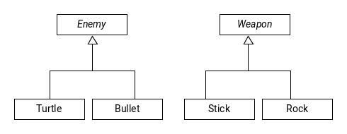

# Design Patterns

## Observer Pattern

Publish subscribe model

- One class: the publisher or subject generates data
- One or more class: called subscribers or observers - receive the data and react.

### Example

Publishers in the form of a spreadsheet cells and subscribers in the form of graphs.

*Picture from November 7*

The abstract class subject has all the common code to al sibjects. The abstract class observer holds only the interface common to all observers.

Sequence to method calls:

  1. Subjects state is updated
  2. `Subject::notifyObservers()` calls each `Observers` notify method
  3. Each observer calls `ConcreteSubject::getState` to get the data and reacts to it

### Example: Horse races

The subject publishes the winners, the observers are individually bettors. They will declare victory if their horse wins.

```c++
class Subject {
  Vector<Observer *> observer;
  public:
    Subject();
    void attach(Observer *ob) { observers.emplace_back(ob); }
    void detach(Observer *ob) { ... } // remove from vector
    void notifyObservers() {
      for (auto &ob : observer) {
        ob->notify();
      }
    }
    ~Subject()=o;
};

Subject::~Subject() {}

class Observer {
  public:
    virtual void notify()=o;
    virtual ~observer() {}
};

class HorseRace : public Subject {
  ifstream in; // source of data
  string LastWinner;

  public:
    HorseRace(string source) : in{source} {}
    ~HorseRace() {}
    bool runRace() { return in >> LastWinner; }
    string getState() const { return LastWinner; }
};

class Bettor : public Observer {
  HorseRace *subject;
  string name, myHorse;

  public:
    Bettor(...) {
      // we set the subject in MIL or in ctor body
      subject->attach(this);
    }
    void notify() {
      string winner = subject.getState();
      cout << (winner == myHorse ? "Win!" : "Lose") << endl;
    }
};
```

Simplifications and adaptations are possible in certain circumstances.

- If there is only one subject, you can merge `Subject` and `ConcreteSubject`. But do not do so lightly, as this reduces your ability to generalizes in the future.
- If the state is trivial, that is being notified is all the information we need, then we can leave out `getState`
- If `subject` and an `observer` can be the same thing (example cells in a spreadsheet) you can have it be one class

## Decorator Pattern

Suppose we want to enhance an object (add features/functionality to it on runtime), example a windowing system.

We start with a basic window. We want to add a scroll bar and a menu for selecting options. We would like to choose these enhancements at runtime.

*Picture from November 9*

The class component defines the interface: the operations your objects will provide. The class `ConcreteComponent` implements the interface the decorator classes inherit from `Decorator` which inherits from the `Component` itself.

For example, a `Window` with a `Scrollbar` is a kind of `Window`, abd has a pointer to the underlying plain `window`. A `window` with a `Scrollbar` and a `Menu` is a `Window`, and has a ptr to a `Window` with a `Scrollbar`.

All of these inherit from a `Window`. So window methods can be called on them polymorphically.

*Pizza picture from November 9*

```c++
class Pizza {
  public:
    virtual float price() const = 0;
    virtual string desc() const = 0;
    virtual ~Pizza();
};

class CrustAndSauce : public Pizza {
  public:
    float price() const override {
      return 5.99;
    }

    string desc() const override {
      return "pizza";
    }
};

class Decorator : public Pizza {
  protected:
    Pizza *p;
  public:
    Decorator(Pizza *p)
    : p{p} {

    }

    // you can't remove toppings from your pizza!
    virtual ~Decorator() {
      delete p;
    }
};

class StuffedCrust : public Decorator {
  public:
    StuffedCrust(Pizza *p) : Decorator{p} {

    }

    float price() const override {
      return p->price() + 2.69;
    }

    string desc() const override {
      return p->desc() + " with stuffed crust.";
    }
};

class Topping : public Decorator {
  string theTopping;
  public:
    Topping(pizza *p, string theTopping)
    : Decorator{p}, theTopping{theTopping} {

    }

    float price() const override {
      return p->price() + 1.00;
    }

    string desc() const override {
      return p->desc() + " with " + theTopping;
    }
};

// Client side code

Pizza *p1 = new CrustAndSauce;
p1 = new Topping{p1, "cheese"};
p1 = new StuffedCrust{p1};

cout << p1->desc() << " " << p->price() << endl;
delete p1;
```

## Iterator Pattern

Our guiding principle is to program interfaces, not implementations.

Abstract base classes define the interface. Work with pointers or references to Abstract Base classes and call the methods declared in the interface. So this way, concrete class objects in and out at will. 

```c++
// It can be templated
class AbstractIterator {
  public:
    virtual int operator*() = 0;
    virtual bool operator!=(const AbstractIterator &o) = 0;
    virtual ~AbstractIterator();
}

class List {
  struct Node;
  ...
  public:
    class Iterator :: public AbstractIterator {
      ...
    };
};

class Set {
  ...
  public:
    class Iterator : public AbstractIterator {
      ...
    };
};
```

We can write functions that operate on Iterators that are derived from `AbstractIterator`. In this way, we can use the same functions to iterator over a variety of different data structures, withour knowing what those underlying structures are.

```c++ 
template <typename Fn> {
  void foreach(AbstractIterator &start, AbstractIterator &end, Fn f) {
    while (start != end) {
      f(*start);
      ++start;
    }
  }
}
```

## Factory Method Problem

Problem: Write a video game with two types of enemies, bullets and turtles. The system should randomly spawns Bullets and Turtles, but Bullets should become more frequent in later levels.

*Picture from November 9*

Since we never know what enemy is going to spawn next we can't call constructors directly. We also don't want to hard code the Policy.

We want it to be customizable and adaptable.

So we put a Factory method in Level that creates our enemies for us.

```c++
class Level {
  public:
    virtual Enemy *createEnemy() = 0;
    // factory method
    ...
}

class NormalLevel : public Level {
  public:
    Enemy *createEnemy() override {
      // create more turtles
    }
    ...
}

class Castle : public Level {
  public:
    Enemy *createEnemy() override {
      // create more turtles
    }
    ...
}
```

## Template Method Pattern

We want subclasses to override some behaviour but still have some common behaviour across all our derived classes.

Example: We have red turtles and we have green turtles. We want to draw our turtles:

```c++
class Turtle {
public:
  void draw() {
    drawhead();
    drawshell(); // virtual
    drawfeet();
  }

private:
  void drawhead() {...}
  void drawfeet() {...}
  virtual void drawshell() = 0;
};

class RedTurtle : public Turtle {
  void drawshell() {
    // draw a red shell
  }
};

class GreenTurtle: public Turtle {
  void drawshell() {
    // draw green shell
  }
}
```

Here, subclasses can't handle the way a turtle is drawn, but can specialize drawings shell.

A public virtual method is really 2 things:

1. public:
  - It is an interface to the client
  - It indicates the behaviour we're providing to the clients
  - Upholds class variants and <mark>pre/post conditions</mark>
2. virtual method:
  - an interface to out subclass
  - A "hook" for our derived class to insert specialized behaviour

It is hard to separate these two ideas from each other if they're wrapped up in one method

- What if we later decide one of our virtual methods has grown too large and decide to split it into two.
  - We now have to change not only our class code, but also the client code.
- How could we make sure our overriding classes conform pre/post condition? What if they change later? Ugly code duplication

### The Non-Virtual Interface (NVI) idiom

NVI says:
- All public methods should be non-virtual
- All virtual methods should be private, except obviously the `dtor`

Example: Digital Media

```c++
class DigitalMedia {
public:
  virtual void play() = 0;
  virtual ~DigitalMedia();
};

// Using the NVI idiom

class DigitalMedia {
public:
  void doplay();
  virtual ~DigitalMedia() {}

private:
  virtual void Play() = 0;
};

void DigitalMedia::Play() {
  if (valid_subscription) {
    doplay();
  }
}
```

Now if we need exert extra control overplay, we can do it:

- We can add before/after code to run around `doplay()` -> also could be specialized
- can add more hooks later through more virtual method calls
- all of this without changing the public interface

It is much easier to keep control over our interface and virtual methods

So the `NVI` idiom extends the template method pattern saying all virtual methods should be wrapped in a non-virtual method

This is a huge benefit without any downside

## STL Maps - for creating dicts

Example: For creating an `array` that can be indexed by an arbbitrary type, i.e. a `string`

```c++
#include <map>
using namespace std;

map<string, int> m;
m["abc"] = 1; // if key doesn't exist, make it, and assign it 1
m["df"] = 4;

cout << m["abc"] << endl; // prints 1
cout << m["ghi"] << endl; // ? -> prints 0

// if a key doesn't exist, it is created and is
//  default initialized

m.erase("abc"); // removed key/value pair
if (m.count("abc")) { // returns 0 or 1
  // do something
}

for (auto &p : m) {
  cout << p.first << "," << p.second << endl;
}

// prints in order based on the key values
// p's type here is a std::pair<string, int>
```

## Visitor Pattern

For implementing double dispatch, virtual methods are chosen on the actual run time type of objects. What if we have a function that operates on two objects?

Example: We want to be able to hit an enemy with a weapon.



We want something along the lines of `virtual void strike(Weapon &w, Enemy &e)`

If we put the enemy, we only get dispatched on enemies' virtual method

<mark>If we put it in weapon, the trick is to double dispatch it to combine overloading and overriding</mark>

```c++
class Enemy {
public:
  virtual void beStruckBy(Weapon &w) = 0;
  ...
};

class Turtle : public Enemy {
public:
  void beStruckBy(Weapon &w) override {
    w.strike(*this);
  }
};

class Bullet : public Enemy {
public:
  void beStruckBy(Weapon &w) override {
    w.strike(*this);
  }
};

class Weapon {
  public:
    virtual void strike(Turtle &t) = 0;
    virtual void strike(Bullet &b) = 0;
};

class Stick : public Weapon {
public:
  void strike(Turtle &t) override {
    // hit a Turtle
  }
  void strike(Bullet &b) override {
    // hit a Bullet
  }
};

class Rock : public Weapon {
public:
  void strike(Turtle &t) override {
    // hit a Turtle
  }
  void strike(Bullet &b) override {
    // hit a Bullet
  }
};

// Client side code

Enemy *e = new Turtle;
Weapon *w = new Rock;
e->beStruckBy(*w);
```

1. Virtuall dispatch calls `Turtle.beStruckBy()`
2. `Turtle.beStruckBy` calls Weapon's virtual method strike that takes a turtle param (compile time)
3. Virtual dispatch chooses `Rock::strike` with a turtle param
4. Done

Visitors can be used as a way to provide an arbitrary hook into your class for specialized behaviour

Example: Add a visitor to the `Book` hierarchy that allows for adding functionality without recompiling the classes themselves.

```c++
class Book { // enemy
public:
  virtual void accept(BookVisitor &v) {
    v.visit(*this);
  }
};

class Text : public Book {
public:
  void accept(BookVisitor &v) {
    v.visit(*this);
  }
};

class BookVisitor { // weapon
public:
  virtual void visit(Text &t) = 0; // strike
  virtual void visit(Book &t) = 0;
  virtual void visit(Comic &t) = 0;
};
```
