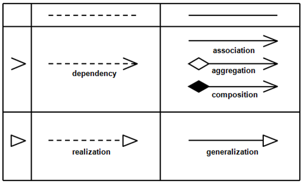

# System Modelling
Building an OO system identifying abstractions of real world things and relationships between those abstractions.

So we want a way to quickly model and represent these relationships, which can be a blueprint or just a quickly readable representation of our program.

## Unified Modelling Language (UML)

|name of the class| Vec |
|---|---|
|fields (optional)|-x: integer|
||-y: integer|
||// the "-" means that it's private|
|methods (optional)|+ operator+ : Vec|
||+ getX : integer|

Visibility:
  - `-` stands for private
  - `+` stands for public

## "Owns-a" relationship

```c++
class Vec {
  int x, y;
  public:
    Vec(int x, int y) : x{x}, y{y} {}
};

class Basis {
  Vec v1, v2;
  // add this to get rid of error
  Basis() : v1{1,2}, v2{3,7} {}
};

Basis b; // error!
```

We try to default construct `b` with Basis's built in default ctor which just default constructs all fields that are objects, namely `v1` and `v2`, but `Vec` doesn't have a default ctor.

Embedding an object inside another object. This kind of a relationship is called a composision. A composition relationship is also another broader type of a relationship called an "owns-a" relationship.

If `A` owns `B`, then:
  - If `A` dies so does `B`
  - `B` has no identity outside of `A`, if you're talking about `B`, it's in the context of `A`
  - If you copy `A`, then you're also copying `B` (deep copy)

Example: A car owns 4 wheels, they are a part of that car. If the car is destroyed, the wheels are too. If you copy a car, you copy it's wheels as well.

Implementation of an "owns-a" relationship is usually done through compilation of classes.

Modelling:

**compositional**




## "has-a" relationship
**aggregation**

Compare the car to music player's playlists. The car owned it's components, what about a playlist? Deleting a playlist doesn't delete those songs. This is a "has-a" relationship. (aggregation)

If `A` has `B`, then typically:
  - If `A` dies, `B` still exists
  - `B` has existance apart from its associated `A`
  - If `A` is copied, `B` is not (shallow copy) thus copies of `A` share the some `B`

Typical implementation:
  You have pointers to the things you "have"

## Inheritance

We have seen owns-a and has-a relationships. But let's consider the relationships in the following example:

```c++
class Book {
  string title, author;
  int numPages;
  public:
    Book(...) { ... }
};

class Comic {
  string title, author, hero;
  int numPages;
  public:
    Comic(...) { ... }
};

class Text {
  string title, author, subject;
  int numPages;
  public:
    Text(...) { ... }
};
```

This is alright, but does it really show the relationship between these types?

Really - A comic is a book and so is a text. Furthermore, how do we use an array (collection) of our library, if it needs to hold these different types.

```c++
union BookTypes { Book *b, comic *c, text *t };
BookTypes myBooks[20];

// This is BAD
```

We can have an array of void pointers and cast our book/comic/text ptrs to void ptrs, and cast back to use.

Rather: We know textbooks are books, and comics are books. A comic `is-a` book, a text `is-a` book. So we want to model an `is-a` relationship. So we can employ the oop concept of Inheritance to solve this problem.

```c++
// base class
class Book {
  string title, author;
  int numPages;
  public:
    Book(string t, string a, int n)
    : title{t}, author{a}, numpages{n} {}
}

// derived class
class Comic : public Book {
  string hero;
  public:
    Comic(...) { ... }
};

// derived class
class Text : public Book {
  string subject;
  public:
    Text(...) { ... }
};
```

  - Derived classes inherit their fields from the base class (`title`, `author`, `numPages`)
  - Any method we can call on a Book, we can call on a `Comic` or a `Text`

Now, consider this ctor for the `Comic` class

```c++
Comic::Comic(string title, string author, int numPages, string hero)
: title{title}, author{author}, numPages{numPages}, hero{hero} {}
```

This fails for the following reasons:
  - `title`, `author` and `numPages` are private to `Book`, we can't access them in `Comic`
  - When objects are created:
    1. Space is allocated
    2. Base class component is initialized
    3. Fields are initialized
    4. Ctor body runs
  - But `Book` has no default ctor!

This works.

```c++
Comic::Comic(string title, string author, int numPages, string hero)
: Book{title, author, numPages}, hero{hero} {}
```

If the base class has no default ctor, you must specify how to construct it in the MIL

There are good reasons to keep the fields hidden of the base class from the subclass, but if you want to reveal these, you can, by specifying them as protected.

```c++
class Book {
  string title, author;
  int numPages;

  protected:
    void addAuthor(string a) { ... }

  public:
    Book(string t, string a, int n)
    : title{t}, author{a}, numPages{n} {}
};
```

Derived classes can access protected fields

```c++
class Text : public Book {
  string topic;
  
  public:
    void addAuthor(string a) {
      Book::addAuthor(", " + a);
    }
};
```

But why put `addAuthor` in the derived class?

If we want to manipulate it, it makes sense to provide a method in the class that contains that fields.

In `C++`, an `is-a` relation is implemented using public inheritance.

```c++
class Text : public Book;

text t{ ... };
t.getAuthor() // okay

class Text : protected Book;
t.getAuthor() // error, `getAuthor` is protected
```

Now, let's consider a method to tell us if a book (of any type) is heavy

```c++
class Book {
  ...
  ...

  protected:
    ...
    ...

  public:
    bool isItHeavy() const { return numPages > 200; }
    ...
    ...
};

class Comic : public Book {
  ...
  ...

  public:
    bool isItHeavy() const { return numPages > 50; }
    ...
    ...
};

class Text : public Book {
  ...
  ...

  public:
    bool isItHeavy() const { return numPages > 500; }
    ...
    ...
};

int main() {
  Book b { "A book", "author", 78 };
  Comic c { "A comic", "author", 78, "hero" };

  cout << b.isItHeavy(); // false
  cout << c.isItHeavy(); // true
}
```

What about this?

```c++
Book b = Comic{ "A title", "Author", 78, "hero" };
cout << b.isItHeavy() << endl; // false
```

Here, `b` only takes `Book` part of the `Comic`, `hero` is ignored using book's `move` ctor

Compiler tries to fit `Comic` into a `Book`, it slices it, ignoring the comic's field

What happens if we access a comic object through a book ptr?

```c++
Comic c { "A title", "Author", 78, "hero" };
Book *pb = &c;
```

Slicing is unnecessary, and if slicing is unnecessary, we could validly call any comic functions.

```c++
cout << pb->isItHeavy() << endl; // false
```

The compiler only knows `pb` is of type Book *, it doesn't know, it only points at a comic object. As such the only thing it can do with the provided knowledge is call the corresponding types fn.

How to make a `Comic` object behave like a `Comic` object even when pointed to by a `Book *`?

## Polymorphism

If there is an inheritance relationship between two classes, an instance of the subclass can be used anywhere an instance of the superclass can be used.

This means that these are valid:

```c++
// B inherits from A
B b{1, 2};
A a = b;

A* a = new B{3, 4};

void foo(A a);
void foo2(A& a);

foo(b);
foo2(b);
```

However, a B object is larger than an A object
  - This means that any time we force a B object into an A object, it doesn't fit and the object will be sliced; only the A part of the object will be copied or moved or considered valid in case of a pointer or a reference.
  - The slicing is called ***object coercion***

## `override` and `virtual`

How to make a comic object act like a comic object regardless of the pointer or reference type it is accessed through?

- Solution is to declare the `isItHeavy` method as `virtual`

With `virtual` methods, we choose when class's method to run, based on the actual type of the object, not based on the type of whatever we're using to access that object.

### Example

```c++
// My book collections
Book *MyBooks[20];
...
for (int i = 0; i < 20; ++i) {
  cout << MyBooks[i]->isItHeavy;
}
```

This code for iterating the array accomodates multiple types under one abstraction(Book). This is called Polymorphism, "many forms"

### Notes

- This way we have been able to write functions that take in `istream&` and pass them an `ifstream&`, because an `ifstream` is an `istream`
- Never use arrays of objects polymorphically. If you need polymorphic arrays, use an array of ptrs.

## Destructor Revisited

```c++
class X{
  int *x;
  public:
  X(int x) : X{new int {x}} {}
  ~X() { delete x; }
}

class Y{
  int *y;
  public:
  Y(int x, int y) : X{new int {x}}, y{new int{y}} {}
  ~Y() { delete y; }
}

Y *py = new Y{1,2,3};
delete py;  // this is fine
X *px - new Y{1,2};
delete px; // leak the y position of the object
```

How can we ensure deletion through a base class ptr calls the right destructor? Make it virtual.

Always declare your destructor virtual when you have inheritance.

- If a class `Y` is not meant to ever be derived, declare `final` - `class Y final : public X { ... }`

## Pure Virtual and abstract classes

```c++
class Student {
  protected:
    int numCourses;
  public:
    // declares Student Fees as pure virtual
    virtual int fees()=0;
};

class Regular final : public Student {
  public:
    int fees() override {
      // calc fees for reg stud
    }
};

class Coop final : public Student {
  public:
    int fees() override {
      // calc fees for coop stud
    }
};
```

What should `Student::Fees` do?

Nothing. It makes no sense to create a student object, all students are either regular or coops. So we explicitly give `Student::fees` no implementation by setting it equal to 0, declaring it pure virtual.

```c++
Student s; // error
Student *reg = new Regular{ ... }; // okay
```

Any class with at least 1 pure virtual method, cannot be instantiated as an object. Such a class is called an **Abstract Class**

Subclasses of an abstract class must implement the pure virtual methods, or else they're also abstract classes.

A class that is not an abstract class is called a **Concrete Class**.

In UML, an abstract class and virtual methods are denoted by _italicizing_ their names.

## Copy and Move ctors/ops with inheritance

```c++
class Book {
  ...
  public:
  // defines copy/move fns
};

class Text : public Book {
  ...
  public:
  // does not define copy/move fns
};

Text t{"algorithms 1", "A programmer", 250, "Algorithms"};
Text t2 = t; // What happens??
```

This just does the build in behaviour, which just copy constructs our base class component with other, and then copy constucts all fields with the fields of other. This is okay in this case, but it may not always be.

To define your own:

```c++
Text::Text(const Text &other) : Book{other}, topic{other.topic} {}

Text &Text:operator=(const Text &o) {
  Book::operator=(o);
  topic = o.topic;
  return *this;
}

Text::Text(Text &&other) : Book{std::move(other)}, topic{other.topic} {}

Text &Text:operator=(const Text &o) {
  Book::operator=(std::move(o));
  topic = o.topic;
  return *this;
}
```

**Note**: Even though the thing other (ot o) reference is an r value, it itself is not. It has a name! So use `std::move(o)` on it to return an rvalue version of it.

The funcs above are same as the built in behaviour, adapt accordingly for Node, etc.

Now, consider:

```c++
Text t1{ ... }, t2{ ... };
Book *pb1 = &t1, *pb2 = &t2;
*pb1 = *pb2;
// this calls Books Copy =; incomplete assignment.
```

That's a partial assignment! We didn't assign the topic fields.

How can we fix it? We could declare it virtual...

```c++
class Book {
  ...
  public:
    virtual Book& operator=(const &o) {
      ...
    }
}

class Text : public Book {
  ...
  public:
    Text& operator=(const Book &o) {
      Book::operator=(o);
      topic = o.topic;
      return *this;
    }
};

// if assigning a text to a book call this function.
```

We are damned if we do and damned if we don't. So we don't create concrete superclasses

```c++
class AbstractBook {
  int numpages;
  string title, author;

protected:
  AbstractBook& operator=(const AbstractBook &o) ...

public:
  AbstractBook(...) ...
  virtual ~AbstractBook()=o;
}
```

Even though we declared `~AbstractBook` pure virtual, we still need to provide an implementation or else our program won't link.

```c++
// AbstractBook.cc
AbstractBook::~AbstractBook() { }
```

For other classes, headers/code would be similar, adapt accordingly.

This design prevents partial assignment and mixed assignments.

**Don't make concrete superclasses, make them abstract**
